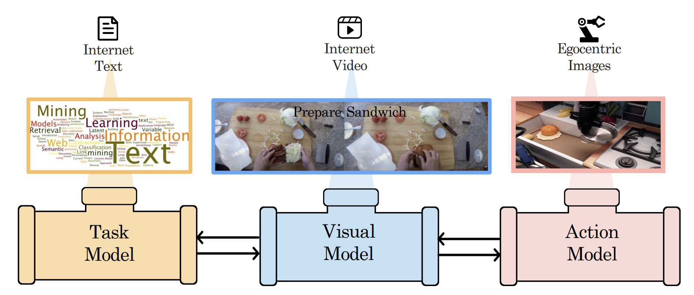

# Compositional Foundation Models for Hierarchical Planning
<div align="center">

[[Website]](https://hierarchical-planning-foundation-model.github.io/)
[[arXiv]](https://arxiv.org/abs/2309.08587)
[[PDF]](https://arxiv.org/pdf/2309.08587.pdf)



</div>

To make effective decisions in novel environments with long-horizon goals, it is crucial to engage in hierarchical reasoning across spatial and temporal scales. This entails planning abstract subgoal sequences, visually reasoning about the underlying plans, and executing actions in accordance with the devised plan through visual-motor control. We propose Compositional Foundation Models for Hierarchical Planning (HiP), a foundation model which leverages multiple expert foundation model trained on language, vision and action data individually jointly together to solve long-horizon tasks. We use a large language model to construct symbolic plans that are grounded in the environment through a large video diffusion model. Generated video plans are then grounded to visual-motor control, through an inverse dynamics model that infers actions from generated videos. To enable effective reasoning within this hierarchy, we enforce consistency between the models via iterative refinement. We illustrate the efficacy and adaptability of our approach in three different long-horizon table-top manipulation tasks.

**NOTE** This is a prelim version of the code. We are working on cleaning up the code and will provide a clean and complete version of the code in coming weeks.


# Training Information

1. The training script for inverse dynamics is contained in `inv_dyn/inv_dyn_ft.py`.
2. The training script for video diffusion is contained in `PVDM/main.py`.
3. The training script for subgoal classifier is contained in `task_subgoal_consistency/train.py`.

# Reference

```bibtex
@article{ajay2023compositional,
  title={Compositional Foundation Models for Hierarchical Planning},
  author={Ajay, Anurag and Han, Seungwook and Du, Yilun and Li, Shaung and Gupta, Abhi and Jaakkola, Tommi and Tenenbaum, Josh and Kaelbling, Leslie and Srivastava, Akash and Agrawal, Pulkit},
  journal={arXiv preprint arXiv:2309.08587},
  year={2023}
}
```

# Acknowledgements

The codebase is derived from [PVDM repo](https://github.com/sihyun-yu/PVDM).
